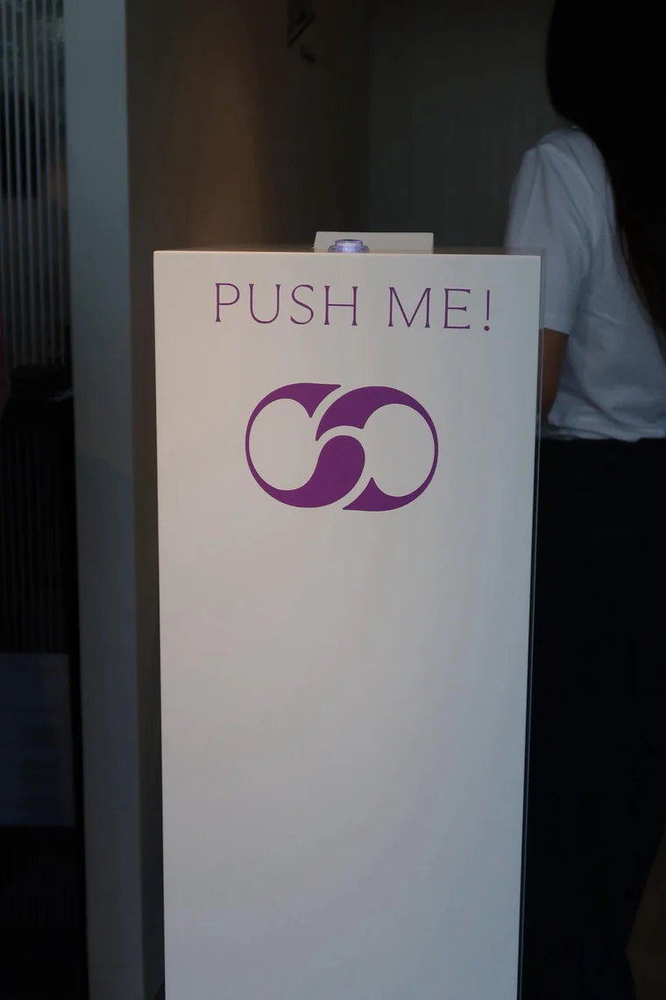

# Aristocrazy Promo Kiosk

An **unattended interactive kiosk** built for **Aristocrazy**'s trade-show stand. A visitor
presses a big arcade button and a thermal printer instantly prints a branded promotional
ticket. The whole thing runs on a **Raspberry Pi 3B**, fully autonomously — staff only plug
it in.


> The hard part wasn't the button. The printer (**Quanzhou Shuojiang SJ-TP01**) does **not**
> speak ESC/POS — it uses an **undocumented proprietary protocol**. I reverse-engineered it
> from a USB capture and wrote a driver from scratch.

---

## What it does

- A visitor presses an **arcade button** → one branded ticket is printed in ~2 seconds.
- Tickets follow a **fixed sequence** (4 × *merchan*, 1 × *piercing*, 4 × *merchan*, 1 × *ta-tu*,
  looping), with the position persisted to disk so it survives reboots.
- Runs **headless and unattended**: auto-starts on boot, recovers from crashes, and ignores
  button mashing (one ticket per press).

<table>
  <tr>
    <td width="42%" valign="top">
      
      <sub>The totem at the stand — the arcade button sits on top.</sub>
    </td>
    <td width="58%" valign="top">
      
      <sub>Sample tickets rendered and printed by the driver.</sub>
    </td>
  </tr>
</table>

## The challenge

The client's printer shipped with unusable Windows software (a single fixed design, manual
button press) and — crucially — **isn't ESC/POS compatible**. To print our own designs from a
Raspberry Pi I had to:

1. **Capture** the USB traffic of the original software (Wireshark + USBPcap).
2. **Decode** the proprietary framing (`0x7e` frame markers, an 88-byte job header, a raster
   image block and an end marker) until a reconstructed bitmap matched the printout byte-for-byte.
3. **Re-implement** it as a Python driver that renders each ticket to a 384 px 1-bpp bitmap and
   speaks the protocol over a USB bulk endpoint.

## How it works

```
[Arcade button] --GPIO17--> [Raspberry Pi 3B] --USB--> [SJ-TP01 thermal printer]
                                   |
                                   +-- Relay 1 -> printer power switch (full power cycle)
                                   +-- Relay 2 -> printer's internal "print" button
```

The printer only commits **new** content when it boots in "autonomous mode" (no USB host) and
its red button is pressed. That behaviour is reproduced with **two relays** driven by the Pi:
one wired **in parallel with the printer's power switch** (a clean power cycle — see the note on
USB VBUS below), and one that "presses" the red button. A `systemd` service starts everything on
boot.

See [`docs/architecture.svg`](docs/architecture.svg) for the full wiring diagram and
[`docs/DOCUMENTATION.es.md`](docs/DOCUMENTATION.es.md) for the complete build log (in Spanish).

## The tricky bits (engineering notes)

- **88-byte job header, not 92.** A 4-byte error in the header made the printer silently reject
  every new job and reprint the previous one. Finding it was the single biggest unlock.
- **USB VBUS backfeed.** Cutting the DC supply wasn't enough: the printer stayed alive on the
  USB 5 V rail, and `uhubctl` on a Pi 3B does **not** cut VBUS. The fix was to switch power
  *downstream of the USB injection point* — i.e. in parallel with the physical power switch.
- **Transfer corruption.** Occasional sheared prints traced to dropped bytes mid-transfer;
  solved with a small inter-chunk delay.
- **Button mashing.** `gpiozero` queues press events, so a kid hammering the button printed a
  stack of tickets. Fixed with a lock + time-based cooldown: one burst = one ticket.

## Tech stack

`Python` · `Pillow` (rendering) · `gpiozero` / `lgpio` (GPIO) · `pyusb` (USB) ·
USB reverse engineering (`Wireshark` / `USBPcap`) · `systemd` · Raspberry Pi 3B · relays.

## Repository layout

```
src/
  kiosko.py            # Orchestrator: button handling, sequence, relays, anti-mash guard
  kiosko_printer.py    # Driver: ticket rendering + proprietary protocol encoder + USB sender
  imprimir_muestras.py # Helper to print one sample of each ticket design
  kiosko.service       # systemd unit for auto-start on boot
docs/
  architecture.svg     # Final wiring diagram
  preview.png          # Sample tickets
  DOCUMENTATION.es.md  # Full build log (Spanish)
```

## Running it (on the Raspberry Pi)

```bash
pip install pillow gpiozero lgpio pyusb
sudo GPIOZERO_PIN_FACTORY=lgpio python3 src/kiosko.py
```

To install as a boot service, copy `src/kiosko.service` to `/etc/systemd/system/`, adjust the
paths, then `sudo systemctl enable --now kiosko`.

## Notes

- The **brand font (ValentineLL) and Aristocrazy image assets are not included** in this
  repository for licensing/IP reasons; the renderer falls back to a bundled system font.
- Published with the client's permission to showcase the engineering work.

## License

[MIT](LICENSE) © Raúl Jiménez
